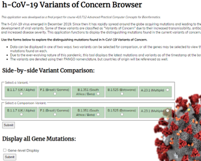

# Kristen Steenbergen 
----------------
## Professional Portfolio
-----------------

### About Me:

I'm a graduate student at Johns Hopkins University and will soon be finishing up my M.S. Biotechnology with an emphasis in Bioinformatics.  I'll be graduating in May of 2022 and am currently pursuing a job that aligns with my interest in using bioinformatics to study transcriptomes, genomes, and epigenomes.  I am interested and available for full-time, part-time, or contract/project-based remote work. 
  
I have found it's easy to list off skills and *say* that I am proficient in R and python, know my way around a relational database, and am familiar with technical writing to communicate results.  But, it is much more impactful to *show* how I can demonstrate these competencies.  This is why I have compiled my most recent past and present projects. Enjoy, and feel free to reach out through [LinkedIn](https://www.linkedin.com/in/kristen-steenbergen/) or at kristen.steenbergen at gmail dot com.  

-------------------
## Resume:  
-------------------
My resume can be viewed <a href="KSteenbergen_PublicResume_Dec2021.pdf">here.</a>  
   
   

-------------------
## Projects:
---------------
### h-CoV-19 Variant Mutation Browser  

<a href="http://www.covidvariantbrowser.com">www.covidvariantbrowser.com</a> is an application I developed to compare and display distinguishing SNP mutations of different variants of h-CoV-2 (SARS-CoV-2).   The mutations can be viewed as a side-by-side comparison of 2 variants, or all the variant mutations present on each gene.  This project was completed as a final project for the *Advanced Practical Computer Concepts* class and utilized a wide array of web development elements such as HTML, CSS, Jquery, Python CGI scripts, and SQL.  
  
*This tool was last updated Dec 15, 2021*
  
------------------
### R-loops and Splicing Gene Expression Research Project

This volunteer research experience involved the analysis of gene expression datasets of Ewing sarcoma cells treated with a splicing inhibitor.  The transcriptomes were assessed to explore how a splicing deficiency in Ewing sarcoma impacts R-loops.  I completed the differential gene expression analysis along with the differential transcript usage analysis in R and prepared the following reports in RMarkdown to be presented at the lab meetings.  

Reports:  
<a href="./DGE_MarkdownReport.html" target="_blank">Differential Gene Expression (DGE) Report</a>   
<a href="./DTU_MarkdownReport.html" target="_blank">Differential Transcript Usage (DTU) Report</a>  

The skills I developed through this project include the further broadening of R programming abilities, wide usage of Bioconductor packages, utilization of NGS data, and the application of biostatistics for RNA-Seq data.

This research project was facilitated by the Bioinformatics Research Network [(BRN)](https://www.bio-net.dev).  The BRN has high standards and in order to participate in a research project,  proof of competency is required by completing mini-projects.  The following RNA-Seq and ChIP-Seq analyses projects were completed and can be found here:  
<a href="https://rpubs.com/KSteenbergen/738407/" target="_self">RNA-Seq Analysis</a>   
<a href="https://rpubs.com/KSteenbergen/743415/" target="_self">ChIP-Seq Analysis</a>

------------
### Research Manuscript:    

This manuscript was completed for the *Bioinformatics: Tools for Genome Analysis* class.  As a group, we researched the heritability of a novel SNP (rs2910164) in the miRNA146A gene that is associated with an increased risk of Behcet's disease.  This was a semester-long project that mimicked the process of peer-review journal publication while utilizing publicly available genomic data.  The final manuscript was formatted with LaTeX software using the PLOS template in Overleaf.  

This project was an excellent opportunity to further develop technical writing skills, along with group communication and collaboration abilities.  I was able to expand my skills in document preparation using LaTeX in Overleaf, increase my familiarity with various tools and file formats, complete NGS data processing including quality control assessments, and carry out the sequence alignment, mapping, and variant calling using a designed pipeline.
  
*Please note, this paper has not been submitted for publication.*    
    
<a href="Genomics_Manuscript.pdf">**Review Manuscript Here**</a> 

----------

### GFF3 Feature Exporter Program in Python
GFF3 is a common file format in bioinformatics, and part of the final exam for my *Practical Computer Concepts* class involved writing a program in python that would parse a GFF3 file for a given feature and then output the sequence in FASTA format.  This program executes with 4 arguments indicating the GFF3 file, type, ID, and value of the feature of interest. 
The video below shows the FASTA output for the YAL068W-A gene, and then the coding sequence of the YAL068C gene in the *S.cerevisiae* genome.  Both of the genes are located on chromosome I. 

*Note: Because this program was written as part of an exam, for plagiarism reasons the code is not publicly shared.  However, I am happy to share the program code with anyone who is not a fellow JHU classmate in the bioinformatics/biotechnology program.*
<video width="800" height="700" controls>
  <source src="GFF3_Feature_Program.mp4" type="video/mp4">
  Your browser does not support the video embedded here.
</video>
----------

  
##### *This portfolio will be periodically updated as more projects are completed*
